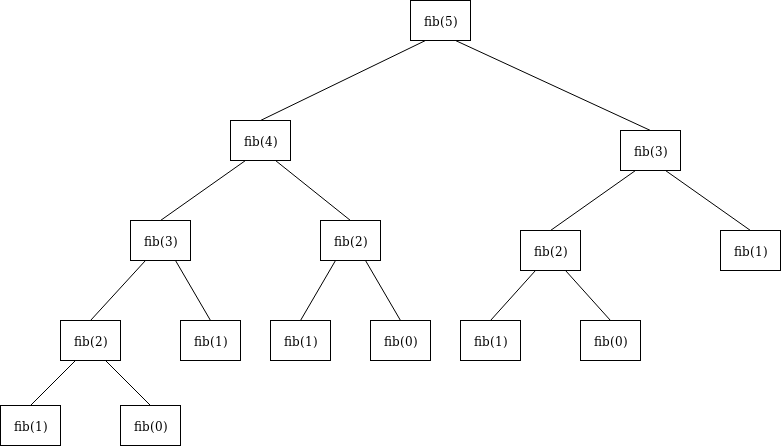

# 509. Fibonacci Number

求第n个斐波那契数。题目很简单，但是题目体现出来的分治思想是十分重要的。

把一个大问题转化为若干子问题，从子问题的答案里计算出问题本身的答案。

题目已经告知，F(n) = F(n - 1) + F(n - 2), for n > 1。说明为了得到F(n)，我们必须先知道F(n - 1) 和 F(n - 2)。

举例来说，为了得到F(5)，我必须先知道F(4)和F(3)。为了知道F(4)，我得先知道F(3)和F(2)。为了知道F(3)，我得先知道F(2)和F(1)。如此不断把大问题切成若干子问题，并从子问题的答案里获取当前问题的答案。

当问题不可再拆分时，我们就可以向上返回了。对于该题来说，那也就是到F(1)和F(0)时，我们已经知道他们俩的值了，所以可以直接返回答案供上一层问题使用。



Time complexity: O(1 + 2 + 4 + 8 + 16 + ... + 2^n) = O(2^n)

Space complexity: O(n), because of the n level recursion.

```java
class Solution {
    public int fib(int n) {
        if(n == 0){
            return 0;
        }else if(n == 1){
            return 1;
        }else{
            return fib(n - 1) + fib(n - 2);
        }
    }
}
```