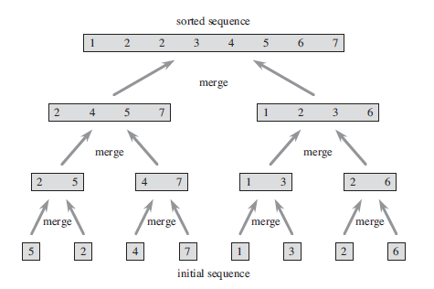

# Laicode 9. Merge Sort

归并排序，利用分治思想的一种排序算法。

我们不断的把一个数组一分为二，对子数组进行相同的拆分，直到不可拆分为止。什么时候不可拆分？子数组长度为1的时候就没法再拆了。

子数组长度为1时，我可以说这就是一个有序的子数组。那么它的上一层就是一个长度为2或者3的数组，这个数组通过对两个有序子数组进行合并，从而使得自己变成有序数组，进而再供上层数组使用。

算法示意图如下，



那么这里主要实现的部分是，
+ 给定两个有序数组，把他们合并成一个有序数组
+ 给定一个无序数组，对他进行拆分排序，之后再合并子数组。

```java
public class Solution {
    public int[] mergeSort(int[] array) {
        if(array == null || array.length <= 1){
            return array;
        }
        int n = array.length;
        int[] aux = new int[n];
        mergeSort(array, 0, n - 1, aux);
        return array;
    }

    /**
     * Given an array, merge sort its [left, right] with auxiliary array.
     */
    private void mergeSort(int[] array, int left, int right, int[] aux){
        if(left >= right){
            return;
        }
        int mid = left + (right - left >> 1);
        mergeSort(array, left, mid, aux);
        mergeSort(array, mid + 1, right, aux);
        merge(array, left, mid, right, aux);
    }

    /**
     * Given a array, [left, mid] is sorted, [mid + 1, right] is sorted.
     * Merge them so that [left, right] is sorted.
     * aux is the auxiliary array.
     */
    private void merge(int[] array, int left, int mid, int right, int[] aux){
        int i = left, j = mid + 1;
        for(int k = left; k <= right; k++){
            aux[k] = array[k];
        }
        for(int k = left; k <= right; k++){
            if(i > mid){
                array[k] = aux[j++];
            }else if(j > right){
                array[k] = aux[i++];
            }else if(aux[i] < aux[j]){
                array[k] = aux[i++];
            }else{
                array[k] = aux[j++];
            }
        }
    }
}
```